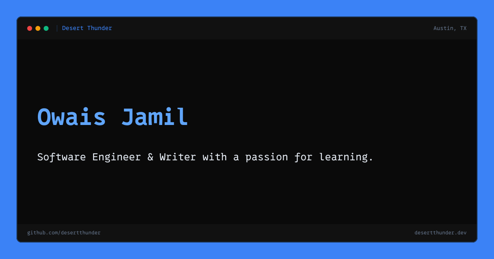

<!-- markdownlint-disable MD041 -->

[](https://desertthunder.dev)

My personal website & blog, powered by [standard.site](https://standard.site)/[leaflet](https://leaflet.pub) and the AT Protocol.

Built with Astro (& React/Takumi-rs for the above OG-image) and deployed to Cloudflare Pages.

Designed by [me](https://linkedin.com/in/owais-jamil).

## Resume

You can view & download my resume at my [resume site](https://resume.desertthunder.dev) (also built with Astro and deployed to Cloudflare Pages).

## Integrations

### AT Protocol / Leaflet Integration

Blog posts are fetched from the AT Protocol using the `site.standard.document` collection
(migrated from the original `pub.leaflet.document` lexicon). Documents are authored on
[Leaflet](https://leaflet.pub) and stored in the author's PDS.

#### How it works

1. **`src/lib/leaflet.ts`** — Type definitions and fetch logic. Calls
   `com.atproto.repo.listRecords` against the `site.standard.document` collection for the
   resolved DID. Each record wraps a `pub.leaflet.content` object containing pages and blocks.

2. **`src/lib/content-loader.ts`** — An Astro content collection loader that calls
   `fetchLeafletPosts` and stores each record in the `blog` collection with its rkey as the ID.

3. **`src/lib/leaflet-transform.ts`** — Converts the block-based Leaflet document model into
   HTML via markdown. Handles all block types (`text`, `header`, `blockquote`, `code`, `image`,
   `unorderedList`, `orderedList`, `horizontalRule`, `website`, `bskyPost`, `button`, `iframe`,
   `math`, `poll`, `page`) and rich text facets (`bold`, `italic`, `underline`, `strikethrough`,
   `code`, `highlight`, `link`, `didMention`, `atMention`, `footnote`).

4. **`src/lib/leaflet-images.ts`** — Downloads and caches blob references (post images and
   website preview thumbnails) from the author's PDS into `public/leaflet-images/` during build.

#### Document structure

```sh
site.standard.document
  ├── title, description, publishedAt, path, tags
  ├── site        → at-uri to site.standard.publication
  ├── bskyPostRef → strongRef to cross-posted bsky feed post
  └── content ($type: pub.leaflet.content)
      └── pages[] ($type: pub.leaflet.pages.linearDocument)
          └── blocks[] (pub.leaflet.blocks.*)
              └── facets[] (pub.leaflet.richtext.facet#*)
```

#### Lexicon references

- [atcute leaflet lexicons](https://github.com/mary-ext/atcute/tree/trunk/packages/definitions/leaflet/lexicons)
- [AT Protocol docs](https://atproto.com/guides/lexicon)
- [Standard Site Spec](https://standard.site/)

## Last.fm Integration

The last.fm integration is a build-time fetch of recent tracks from the last.fm API and rendered on the home page. You can learn more by looking at the [code](./src/lib/lastfm.ts)
or reading the last.fm [api docs](https://www.last.fm/api/show/user.getRecentTracks).

## Project states

Projects use a standardized `status` frontmatter field.

Valid states are defined in the `project-status` module and enforced by the site's
content collection schema.

| State          | Meaning                                                               |
| -------------- | --------------------------------------------------------------------- |
| `active`       | Maintained, usable, and currently active.                             |
| `pre_release`  | In active development but not yet considered stable or final.         |
| `experimental` | Exploratory work where the interface, scope, or viability may change. |
| `paused`       | Not currently being worked on, but not retired.                       |
| `completed`    | Finished or feature-complete for its intended scope.                  |
| `archived`     | Retired, no longer maintained, or kept for reference.                 |

The UI treats `active`, `pre_release`, and `experimental` as "in progress."

## Credits

Your eyes don't deceive you. The background of the opengraph image is [bliss](https://en.wikipedia.org/wiki/Bliss_%28photograph%29#), the
default windows XP background.
