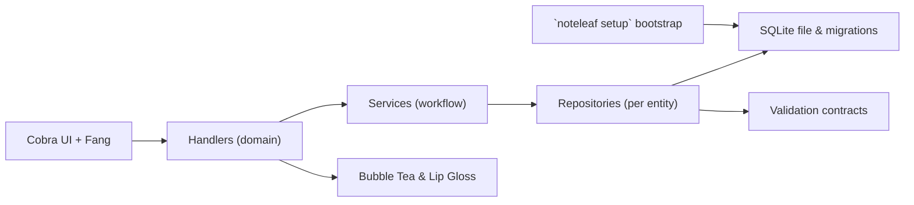

Most of my career as an engineer has been spent building web based UIs and even smaller projects used small web apps as entry points.
While starting my Golang journey a couple of years ago, I found [Charm](https://charm.land/), an awesome company that produces a lot of really great open source terminal UI libraries. It helped turn Go into my go to tool for building CLIs. I've made a lot of unfinished projects with it. More recently I've become better at planning (largely thanks to LLMs helping me stay organized) and have finished more work and producing software that I'm really proud of, so naturally I made *another* to-do list app.
It's a little more than that actually. In marketing-speak, you could call it "a unified companion for task management, note-taking, and media tracking without leaving the terminal." The project is inspired by and borrows lessons from TaskWarrior and the todo.txt spec while using more modern tooling.
It taught me a lot about testing patterns and the challenges of maintaining a ballooning code base that aims to be simple. Today, I'd like for this essay to walk you through the architectural underpinnings of the codebase and demonstrates how those choices surface in everyday usage.

## Design Principles

I try to maintain three core principles while working on the project:

- **Terminal-first ergonomics**
    - Commands, interactive TUIs, and rendering pipelines are optimized for a text-only environment.
- **Unified knowledge graph**
    - Tasks, notes, and media share consistent identifiers, allowing future cross-linking without schema churn.
- **Predictable layering**
    - Presentation, orchestration, and persistence stay isolated so the system can grow without turning into a monolith.

These principles echo through the command surface, supporting libraries, and the broader project documentation.

### System Topology

The runtime can be sketched as:

- The CLI entry point wires the command tree, sets up logging, and injects domain handlers.
- The handler layer orchestrates domain logic, leaning on workflow services for multi-step operations.
- The repository layer isolates SQL queries, backed by the shared SQLite schema and migrations.
- The UI layer hosts shared styling assets and Bubble Tea models for the interactive views.

User commands arrive through Cobra (with charm's Fang enhancing help output), which parses flags and routes execution to domain-specific handlers.
Those handlers perform orchestration, sometimes delegating to services when a workflow spans multiple operations. Once the intent is clear, repositories translate the request into SQL against the SQLite database, confident that migrations have already run during bootstrap.
Interactive flows tap BubbleTea for stateful TUIs, while validation components enforce invariants before data leaves the handler layer.

Because each dependency flows downward, the CLI can remain responsive while still performing validation and migrations before commands run.

## Entry Points

The executable starts in the CLI entry point, where the root command assembles Cobra command groups for core domains (task, note, article, movie, tv, book) and management tooling (`setup`, `status`, `config`, `reset`). I opted to adopt Charmbracelet's `fang` package to enrich Cobra's help output and versioning, while a custom application struct wraps the database and configuration lifecycle. Charm's stuff is also just...pleasant.

## Command Composition

The command surface follows a CommandGroup pattern: each domain registers a tree of subcommands (for example, `task`, `task list`, `task timesheet`).
This approach trades a little boilerplate for a consistent dependency story. Handlers are injected with repositories, which are in turn given database connections from the `store` package.

## Design Patterns in Practice

Layering is reinforced by a small set of recurring patterns that aim to keep complexity in check:

1. **Constructor-based injection**
  Every handler and service receives its dependencies through explicit constructors, making wiring predictable and testable.
2. **Repository abstraction**
  Data access goes through repository interfaces, separating persistence details from business rules and enabling fast in-memory tests.
3. **CommandGroup composition**
  CLI domains register themselves through a shared contract that enforces consistent flags, help text, and dependency wiring.
4. **Model–View–Update TUIs**
  Bubble Tea components follow Elm's MVU loop, allowing state transitions to remain pure and easy to reason about.
5. **Validation boundaries**
  Validation logic sits at the repository edge, ensuring only well-formed data crosses between layers.

Together, these patterns minimize hidden coupling and make it easy to introduce new verticals say, a podcast or music tracker without rewriting the core scaffolding.

## Persistence and Data Access

Persistence lives in the storage layer. A database wrapper opens the SQLite file, applies migrations, and surfaces a connection pool that repositories can reuse.
Migrations ship alongside the storage code (using `embed` from the standard library), giving Noteleaf deterministic schema updates.

Each domain has a dedicated repository interface that defines CRUD operations and validation rules.
This design keeps raw SQL in one place, enables mocking repositories in tests, and prevents business logic from depending on persistence details.
Domain models structs with shared fields like `ID`, `Created`, and `Modified` share a common foundation.
This makes it straightforward to add new entities without rewriting the plumbing and gives us a shared signature for our models.

## UI Layers

Noteleaf provides both terse command output and full-screen TUIs. Text-mode commands use Cobra directly, emitting tables or JSON.
When the `--interactive` flag is set, handlers swap to Bubble Tea programs provided by the UI layer.
LipGloss color maps give the views a cohesive palette, and `glamour` renders Markdown for notes and articles, to keep long-form content readable.

The separation of concerns here is deliberate: Cobra remains the imperative shell for scripts and automation, while Bubble Tea handles stateful interactions such as scrolling through tasks or previewing an article.

## Working with the Application

At some point the architecture has to prove itself in front of a blinking cursor.
The first launch walks straight through the layered story: `noteleaf setup` bootstraps configuration, runs migrations, and leaves behind a clean database ready for seeds or real work.
From there, each command family showcases a different slice of the stack.

Take tasks. When a user fires off `noteleaf task add "Draft blog post"`, the CLI marshals input into a handler, validation fires at the repository boundary, and the SQLite store records the new entity.
That same flow keeps working when time tracking enters the picture: `task start`, `task stop`, and `task timesheet` all reuse the same components, just with more interactions between services and repositories. The payoff is consistency so that you always know where state is mutated and where presentation stays pure.

Notes lean on the same backbone but exercise the UI layer more aggressively, using styled text rendering & interactive navigation in tandem

Articles and media queues extend the architecture beyond local data. A single `noteleaf article add <url>` call orchestrates HTTP fetches, parsing rules, dual-format storage, and metadata updates without collapsing into an untestable ball.
Books, movies, and TV shows inherit the same structure, proving that the repository-oriented approach can stretch to new verticals with only targeted additions.

The article parser itself is a bit of a chimera of rule-based precision and graceful fallbacks. Domain-specific scrapers lean on XPath selectors (from five-filters) so particularly stubborn sites can declare exactly which nodes contain headlines, bylines, or body copy. This provides tailored extraction for storing articles to read later.

---

Everything tries to be predictable. Commands feel cohesive because handlers mediate everything, repositories own persistence, and the UI layer never touches business logic directly.
Real-world usage has become the strongest validation that the architectural choices hold up under daily use, not just in diagrams.

## Testing

Automated coverage mirrors the runtime layering. Handler tests spin up temporary SQLite databases and produce real instances through factory helpers, guaranteeing isolation without resorting to brittle mocks. Repository tests lean on faker powered data builders, ensuring edge cases (duplicate tags, invalid recurrence rules) surface early.
Services that speak to the network run against configurable HTTP mocks so both success and error branches are deterministic.

Interactive experiences receive the same attention.
Bubble Tea models plug into a TUI test suite that simulates key presses, terminal resizes, and async messages while asserting on rendered output.
Command trees undergo structural verification to ensure help text, aliases, and interface compliance never regress.
Context cancellation shows up throughout to prove that long-running operations unwind gracefully when the user aborts or resources disappear.

This layered strategy keeps the suite fast but expressive: integration-style confidence at the handler boundary, focused verification around repositories, and real world (hi-fi) simulation for TUIs and interactive prompts.

### Configuration, Logging, and Observability

Configuration loads into a dedicated config struct, pulling from TOML files (when did TOML become the standard?) and surfacing user preferences like default editor or color scheme. Logging is centralized through shared utilities, exposing a structured logger configured once during startup.

Testing guidance in the developer documentation details how to run unit tests, use in-memory SQLite databases, and verify repository contracts.
A collection of Just recipes wraps common workflows (format, lint, tests), though the CLI also works directly with `go test ./...`.

## The Future

The architecture already anticipates future expansion or forked extension:

- **CommandGroup abstraction** lets developers register new domains with consistent constructors and dependency wiring.
- **Repository interfaces** make it feasible to swap persistence backends or inject mocks in higher-level tests.
- **Dual-format article storage** keeps options open for exporting to static sites or syncing to external readers.
- **Bubble Tea components** are composable; new TUIs can reuse list or detail views without reimplementing styling.

The public roadmap outlines plans for time tracking integrations, richer search filters, and a plugin system.
Because the layers are well-separated, each initiative can unfold with minimal risk of regression elsewhere.

## Closing Thoughts

Noteleaf demonstrates how a disciplined, layered architecture can make a multi-domain CLI feel cohesive.
By leaning on Go's strengths dependency injection through constructors, tight integration with Cobra, and a straightforward SQLite stack the project remains approachable for contributors while offering power-user features like TUIs, article parsing, and time tracking.
Whether you script against the commands or live inside the interactive views, the same architectural spine provides consistency and room to grow.
If the highlights here spark curiosity, follow your preferred path through the [codebase](https://github.com/stormlightlabs/noteleaf) to see the details firsthand.
